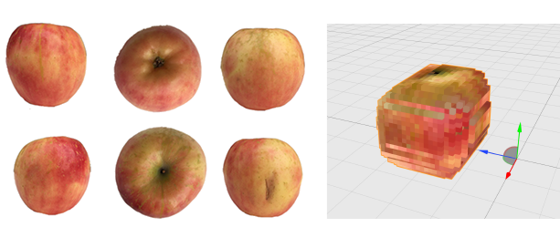

# voxel_scanner

A simple 3D voxel scanner program that reads in 2D images of a model and creates a 3D matrix of colored cubes (voxels) for video games, 3D printers, model simulations, game developers, and more.



*__Input:__ 6 images of an apple from each perspective*

*__Output:__ .obj and .mtl files*

You must take 6 pictures of an object from each angle; top, bottom, left, right, front, back.  Each image needs to have transparency alpha channels enabled, so that the transparent parts are taken out of the model.  The app automatically creates a voxel 3D object in __32x32x32__ colored voxels.  A voxel is a 3D cube and is commonly used in video games and by 3D printers.

There is also an optional mode to generate a flattened 2d (32x1024) png image of the model.

The generated Wavefront OBJ file (\*.obj) and the Material Template Library file (\*.mtl) can be opened with almost any 3D modeling tool.

### Building

No external libraries are required, only a C++ compiler is required.  Has not been tested on Windows but could work.

1.

```
make
```

2.

```
cd bin/release/
```

3.
```
./voxel_scanner -i test_input -o /Users/me/Downloads/model
```

### Algorithm

1. Input png's
2. Create Empty 3D matrix
3. Ignore png alpha < 255
4. RGB of png is set in matrix
5. Each view angle transform is applied
6. Reshape the matrix from each perspective
7. Convert 3D matrix to OBJ format
8. Output OBJ and MTL

### Apple example

[](http://www.youtube.com/watch?v= 5X2W6qlcgCo)

### Seashell example

[](http://www.youtube.com/watch?v= YhFYsSFmrJQ)

